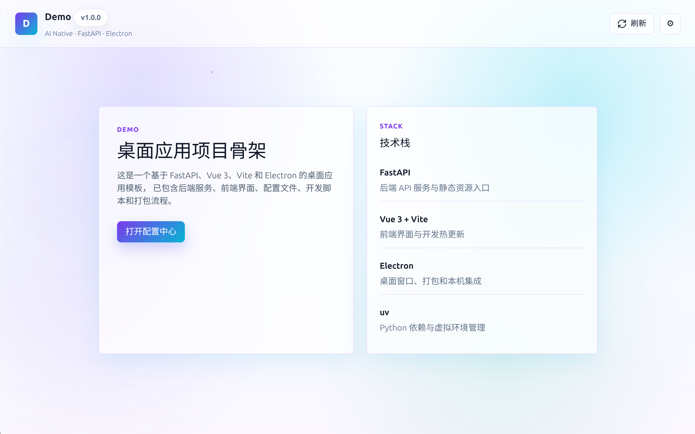

# xb - 前后端打包构建工具

**xb**（PyPI: `xb-init`）是一个基于 `uv` 又类似 `uv` 的项目管理工具，专为快速初始化 **UV + FastAPI + Vue3 + Electron** 桌面应用而生。一条命令拉起完整工程脚手架，开发、构建、版本管理一站式搞定。



## 核心特性

- 一键初始化完整项目结构（`xb init demo`）
- UV + FastAPI + Vue3 + Electron 开箱即用
- 自动安装前端和 Electron 依赖（`npm install`，内置国内镜像源）
- 自动 `git init` 并提交首个 commit（含 lock 文件）
- 自动生成 `AGENTS.md`（AI 编码助手协作约定）
- 内置全局亮色/暗色主题切换
- 可选 sudo 免密配置（`--sudoers`）
- 可选自定义应用图标（`--icon`）
- 内置开发、构建、版本管理命令
- 自动版本检查与一键升级（`xb --upgrade`）
- 环境诊断（`xb doctor`）
- DEB 安装钩子（postinst / postrm）

## 安装

```bash
# 安装 uv（若已有可跳过）
curl -LsSf https://astral.sh/uv/install.sh | sh

# 方式一：从 PyPI 安装（推荐）
uv tool install xb-init

# 方式二：从源码安装
git clone -b release_v0 https://github.com/xuebli/xb.git
cd xb
uv sync
uv tool install .

# 验证
xb --help
```

## 快速开始

```bash
# 创建项目
xb init demo

# 带 sudo 免密配置
xb init demo --sudoers

# 带自定义图标
xb init demo --icon ~/icons/app.png

cd demo

# 启动开发环境
xb dev

# 查看状态
xb dev status

# 停止
xb dev stop
```

> **`xb init` 自动行为**：
> - 执行 `npm install`（frontend + electron），生成 `package-lock.json`
>   - 生成的 `.npmrc` 已配好华为云镜像；electron 约 200MB 二进制也走镜像下载
>   - 若安装失败或超时，会打印提示但不中断项目创建，可稍后手动重试
> - 执行 `git init` 并提交首个 commit（包含所有文件和 lock 文件）
> - 若检测到 PyPI 有新版 xb，会询问是否先升级再创建项目
> - 若系统未安装 git 或未配置 `user.name/user.email`，打印警告但不阻塞

## 命令一览

| 命令 | 说明 |
|------|------|
| `xb init <name> [--sudoers] [--icon PATH]` | 初始化项目 |
| `xb dev [start\|stop\|status]` | 启动/停止/查看开发环境 |
| `xb build [all\|frontend\|backend\|electron]` | 构建项目 |
| `xb build -f / -b / -e / -a` | 构建快捷 flag |
| `xb version [patch\|minor\|major]` | 读取或更新版本号 |
| `xb doctor` | 检查开发环境 |
| `xb --upgrade` | 升级 xb 到 PyPI 最新版本 |

## 应用图标

```bash
# 显式指定图标
xb init demo --icon ./my-icon.png

# 不指定时自动查找以下约定路径：
# ./app-icon.png, ./icon.png, ./<package>.png,
# ./assets/app-icon.png, ./assets/icon.png, ./resources/icon.png
```

## 生成的项目结构

```
demo/
├── pyproject.toml          # Python 依赖（uv 管理）
├── AGENTS.md               # AI 编码助手协作约定
├── README.md               # 项目说明（含三种启动方式详解）
├── .gitignore
├── backend/                # FastAPI 后端
│   ├── main.py             # FastAPI 入口（lifespan / CORS / SPA 兜底）
│   ├── backend_build.py    # PyInstaller 打包脚本
│   ├── api/                # API 路由层
│   └── managers/           # 基础设施单例
├── frontend/               # Vue 3 前端
│   ├── package.json
│   ├── package-lock.json
│   ├── .npmrc              # npm 镜像源（华为云）
│   ├── vite.config.js
│   └── src/
├── electron/               # Electron 主进程
│   ├── package.json
│   ├── package-lock.json
│   ├── .npmrc              # npm + electron 二进制镜像源
│   ├── main.js
│   └── resources/          # icon + postinst/postrm
├── version/                # 版本管理（pre-commit hook）
├── configs/                # 配置文件
├── datas/                  # 运行时数据（gitignore）
├── dev.sh                  # 开发脚本
├── build.sh                # 打包脚本
└── .venv                   # Python 虚拟环境
```

## xb 工具自身结构

```
xb/
├── cli.py                  # CLI 入口（Click + Rich）
├── __init__.py             # 版本号
├── commands/               # 子命令实现
│   ├── init.py             #   初始化（升级检查、图标、npm install、git init）
│   ├── dev.py              #   开发环境管理
│   ├── build.py            #   构建
│   ├── version.py          #   版本管理
│   ├── doctor.py           #   环境诊断
│   └── upgrade.py          #   升级 xb
├── templates/              # Jinja2 项目模板
│   ├── backend/
│   ├── frontend/
│   ├── electron/
│   ├── configs/
│   ├── scripts/
│   ├── version/
│   └── root/
└── utils/
    ├── template_engine.py  # 模板渲染引擎
    ├── validators.py       # 包名校验
    ├── click_helpers.py    # 中文化 Help 输出
    └── version_check.py    # PyPI 版本检查（24h 缓存）
```

## 环境要求

- **Python**: 3.12+
- **Node.js**: 16+
- **npm**: 8+
- **uv**: 已安装
- **OS**: Linux（Ubuntu / Debian）

使用 `xb doctor` 可一键检查所有环境依赖。

## 许可证

MIT
