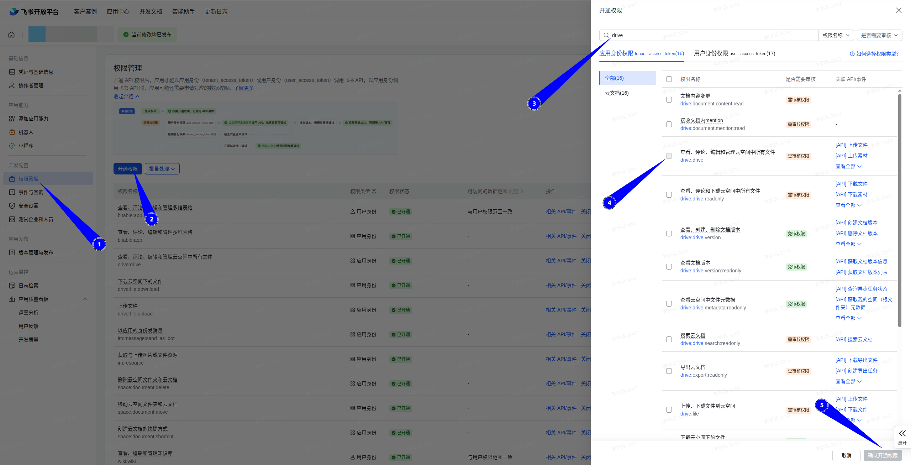
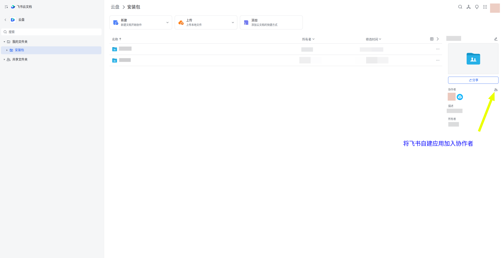
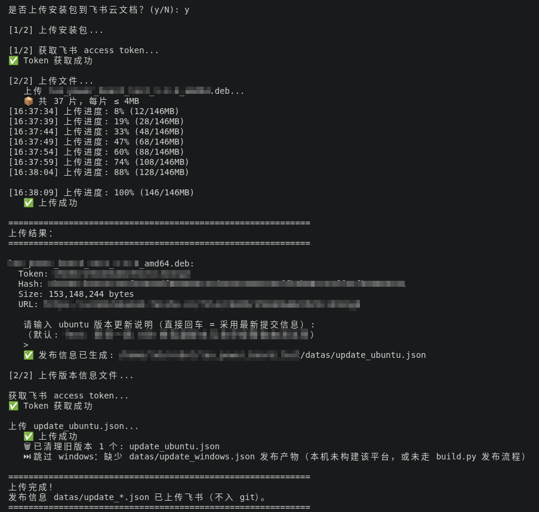
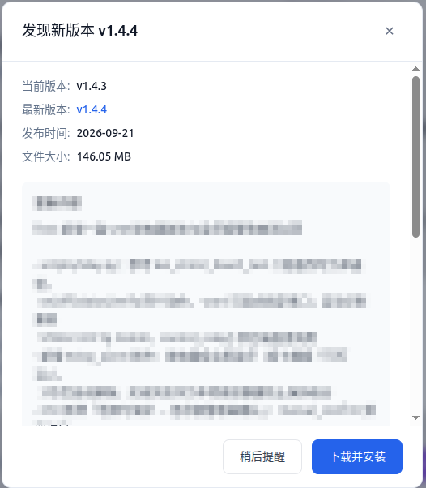

# 软件自动更新说明（xb `--update` 功能详解）

> 本文详细解释 `xb init demo --update` 生成的**应用内自动更新**功能
> （对应 xb 仓库提交 `e3d2c72`）。
> 看完这篇你就明白：新版本是怎么"上架"的、用户的软件是怎么"发现并装上"新版本的、
> 用户配置为什么不会丢、飞书那边要准备什么、以及**作为 AI 开发者你在这个机制下
> 必须遵守的三条纪律**。

---

## 一句话总览

```
开发电脑把新版本"寄存"到飞书网盘  →  用户的软件自己去飞书"查快递"
  →  发现新版本就"签收下载"  →  自动"换新装"（安装）  →  重新打开就是新版
```

整个过程用户的**配置、密钥、数据都不会丢**（第六节细说为什么）。

---

## 一、这个功能是什么、生成了什么

`xb init demo --update` 会在标准脚手架之上额外生成一套完整更新链路。
Ubuntu 的免密安装走 **polkit**：DEB 安装时由 postinst（root 身份）自动部署
授权动作与特权入口，管理员组（sudo/wheel）用户全程无感更新，
**任何环节都不收集、不存储用户密码**。

### 生成的文件与职责

| 位置 | 职责 |
|------|------|
| `backend/api/update/__init__.py` | 更新接口：检查 / 信息 / 下载 / 进度 / 安装 |
| `backend/services/updater.py` | 核心逻辑：版本比较、信息拉取、并发下载、SHA256 校验、配置备份与迁移、双平台安装编排 |
| `backend/services/feishu_client.py` | 飞书开放平台封装：token 缓存、文件夹列举、4 线程分块下载 |
| `backend/managers/secret_obfuscator.py` | 敏感值混淆（`obf1:` 前缀，防围观级别） |
| `backend/app_version.py` | 后端运行时版本号（打包态读不到 package.json，靠它） |
| `scripts/feishu_upload.py` | 发版端：安装包/版本信息上传飞书、旧文件清理 |
| `configs/config_changes.json` | **配置迁移清单**（初始为 `{}`，见第五节） |
| `frontend/src/components/version/UpdatePanel.vue` | 更新弹窗（版本信息 / 更新说明 / 迁移明细 / 进度条） |
| `frontend/src/components/version/CommitHistoryPanel.vue` | 版本弹窗里的提交历史 |
| `frontend/src/composables/useUpdate.js` | 前端更新逻辑：启动/每小时定时检查、下载进度轮询 |
| `electron/resources/polkit/privileged.policy` | 特权操作声明文档（pkexec 判定固定走 exec action，本文件仅作声明） |
| `electron/resources/polkit/privileged.rules` | 免密放行规则：对 exec action + privileged-helper 的 program 白名单生效 |
| `electron/resources/polkit/privileged-helper.sh` | root 拥有的白名单执行器，只放行预先登记的特权操作（装更新 deb 等） |
| `GitVersionBadge.vue`（改造） | 顶栏版本号徽章 = 更新入口：点开是"版本弹窗"（提交历史 + 检查更新按钮） |

另外 `build.py` 会多出发布编排（上传询问、进度渲染、`--upload-only`），
`version_manager` 会在版本 bump 时多同步两个文件（共 4 个）。

---

## 二、角色分工

| 角色 | 干什么 | 用到的工具 |
|------|--------|-----------|
| **发版者**（开发电脑） | 打包 → 传飞书 → 写"货架标签" | `./build.py -a` 一条命令 |
| **用软件的人**（产线电脑） | 什么都不用干，软件自己检查、下载、装 | 顶栏版本号徽章 |

**比喻**：飞书云盘的一个文件夹就是"货架"，安装包（`.deb`/`.exe`）是"货"，
版本信息文件（`update_ubuntu.json` / `update_windows.json`）是"货架标签"。
**客户端永远只看标签决定有没有新货。**

---

## 三、飞书侧准备（发版者一次性配置）

1. 在 [飞书开放平台](https://open.feishu.cn) 创建**企业自建应用**，得到
   `app_id` 和 `app_secret`；
2. 开通 **`drive:drive`** 权限（最容易漏的一步！）：
   - 没有它：上传成功但列举/删除/下载全失败，客户端永远"没有新版本"；
   - **开通后必须"创建版本并发布"**，管理员审核通过才生效——只开通不发布 = 没开通；

   

3. 在飞书云盘建一个文件夹当"货架"，复制浏览器**完整链接**：
   `https://xxx.feishu.cn/drive/folder/一串字符`；
   **并把第 1 步创建的自建应用添加为该文件夹的协作者**（应用对文件夹没有
   协作权限时，token 再对也访问不了里面的文件）：

   
4. 三样东西填进项目的 `configs/secrets.yaml`（已 gitignore，永不进仓库）：

```yaml
feishu:
  app_id: "cli_xxx"
  app_secret: "xxx"
  update_folder_url: "https://xxx.feishu.cn/drive/folder/一串字符"
```

---

## 四、发版流程（开发电脑）

一条命令：`./build.py -a`（构建 + 询问上传 + 写标签），
或 `./build.py --upload-only` 只传已有安装包。
全流程实录（分片上传进度 → 上传结果 → 输入更新说明 → 版本信息上传 → 旧标签清理）：



### 关键机制 1：凭证自动同步与混淆（发版者可以"开箱填明文"）

1. 构建开始时，`build.py` 把你本机 `configs/secrets.yaml` 的内容与
   `configs/secrets.yaml.example` 做**深度合并**（真实值覆盖写入，
   **example 独有的占位键原样保留**）；
2. Electron 打包前，把 example 里的敏感键（键名含 secret/password/token）
   混淆成 `obf1:xxxx` 密文——打进安装包的就是密文，用户**开箱即用**；
4. 构建结束（无论成败）example 自动恢复为留空模板——**真实凭证永远只在你本机**。

> 混淆是"防围观"级别（XOR+Base64，可被软件自动还原），防好奇不防逆向。

### 关键机制 2：上传与"货架标签"

- 安装包大于 20MB 自动走**分片上传**（4MB/片，失败重试），终端按 5 秒一行
  显示带时间戳的进度，上传结束立即补打 100%（不拖到提示语之后）；
- **清理策略**：`update_*.json` 同名旧文件自动删除（防止客户端误读残缺旧标签）；
  **安装包只记录不删除**——货架上保留全部历史版本，方便回滚；
- 更新说明直接回车 = 采用最新一条 git 提交信息；
- 标签内容：版本号、发布日期、更新说明（按行数组）、安装包的
  `file_token`（应用内下载唯一入口）/ URL（仅展示）/ SHA256 / 大小，
  以及第五节的 `config_changes` 全文。

---

## 五、配置迁移清单 `configs/config_changes.json`（AI 开发者重点！）

**这是整个功能里唯一需要你持续手工维护的文件，也是新手最容易写错的地方。**

### 5.1 它解决什么问题

用户机器上的配置文件是"存量"——新版本代码改了配置结构（新增键/删除键/改默认值），
用户升级后配置文件**不会自动重写**。迁移清单就是告诉安装器：
"从版本 X 升上来的用户，配置要怎么改"。

### 5.2 顶层 key 的语义（⚠️ 最容易写错）

**顶层 key = 变更生效前用户所处的最后版本号**（即引入变更的那次 commit **之前**
`electron/package.json` 里的版本），**不是**"引入变更的新版本号"。

运行时应用条件（`backend/services/updater.py` 的 `filter_config_changes`）：

```
用户当前版本 <= 块版本 < 要安装的包版本
```

为什么不能写新版本号：假设变更随 1.1.0 发布、块却写成 `"1.1.0"`，
用户从 1.0.0 **直升 1.1.0** 时 `目标(1.1.0) > 块(1.1.0)` 不成立 → 被条件二挡掉 →
**迁移失效**。写成 `"1.0.0"` 则：1.0.0 升 1.1.0 应用 ✓，1.1.0 升 1.2.0 不再应用 ✓。

### 5.3 条目格式

```json
{
  "1.0.0": {
    "summary": "secrets.yaml 新增 test.test 占位键（随 1.1.0 发布）",
    "files": [
      {
        "filename": "secrets.yaml",
        "action": "merge",
        "description": "新增 secrets 键 test.test（值取自随包模板，留空）",
        "add_items": [{ "key": "test.test" }]
      }
    ]
  }
}
```

### 5.4 三种 action

| action | 用途 | 说明 |
|--------|------|------|
| `merge` | YAML 增量合并（最常用） | 配合 `add_items`（补缺失键）/ `overwrite_items`（覆盖值或删除键）/ `delete_items`（删键）/ `keep_items`（保护名单，绝不触碰） |
| `create` | 新建配置文件 | 已存在则跳过，绝不覆盖用户文件 |
| `overwrite` | 整文件覆盖 | csv 等"程序自带数据"专用；启动时还会由 `sync_declared_overwrites` 自动对齐，覆盖前留 `.bak` |

要点：

- **没被清单提到的键一律原样保留**（以用户现有配置为基底做增量修改）；
- `add_items` / `overwrite_items` **不带 value** 时，值从安装包内
  `<文件名>.example` 模板取——这是 secrets 类条目的**规范写法**（真实值不进仓库）；
  业务 yaml（无 example）必须显式带 value；
- 落盘前键名含 secret/password/token 的明文值自动混淆；
- 用户已有该键时**跳过不覆盖**（幂等，不碰用户已填的值）。

### 5.5 文件维护约定

- 顶层版本块按版本号**从高到低**排列：新条目插在文件**最上方**；
- 追加条目时用版本号元组倒序**重排整个文件**，不要直接 append 到末尾；
  （运行时会自行按块版本升序应用，文件顺序只影响可读性，但必须遵守。）

### 5.6 双保险机制（为什么"安装时跳过"不等于失败）

| 层 | 时机 | 读的 example | 负责 |
|----|------|-------------|------|
| 安装时迁移 | 新包安装**前** | **旧**包内的 example | 改值/删除/覆盖（必须在换文件前做） |
| 启动补齐 | 新包**首次启动** | **新**包内的 example | 新增键类（旧包 example 天然没有新键） |

所以：新增占位键类条目在安装时**静默跳过属正常现象**（日志刻意不打），
升级后首次启动会以 `[补齐] secrets.yaml: test.test` 的形式自动补上。
想让它安装时就生效，显式带 `"value": ""` 即可。

---

## 六、客户端全流程与数据安全

### 流程

1. **检查**：启动时 / 每小时 / 点版本号徽章 → 版本弹窗 → 「🔄 检查更新」；
   远程信息缓存 5 分钟（`?force=true` 跳过）；
2. **下载**：4 线程分块并发（8MB/块）+ `.part` 临时文件防半截包 + SHA256 校验，
   进度条与预计剩余时间实时显示。检查到新版本时会弹出更新弹窗
   （版本信息 / 更新说明 / 配置迁移明细）：

   
3. **安装**（点「立即安装更新」）：
   - 备份整个配置目录到 `datas/config_backups/版本号_时间戳/`；
   - 应用第五节的迁移；
   - Ubuntu：趁应用存活用免密 `sudo dpkg -i`（免密规则只放行
     `datas/updates/*.deb`，且启动发证、退回收证）；Windows：等应用退出后
     `setup.exe /S` 静默安装（运行中的 exe 被锁，只能退出再装）；
   - 安装日志：`datas/logs/update_install.log`；
4. **首次启动**：`init_user_configs` 用新包 example 深合并补齐用户新增键
   （日志 `[补齐] secrets.yaml: test.test`），已有值一律不覆盖。

### 数据安全三重保护

1. 升级前整体备份（保底）；
2. 迁移只动清单上写的键，其余设置/密钥一个字符都不碰；覆盖前留 `.bak`；
3. 迁移失败软件照常启动（配置按默认值运行），不会"升级完打不开"。

---

## 七、API 速查（`/api/update/*`）

| 方法 | 路径 | 说明 |
|------|------|------|
| GET | `/api/update/check` | 检查更新（`?force=true` 跳过 5 分钟缓存） |
| GET | `/api/update/info` | 完整版本信息（含 source: remote/local/none） |
| POST | `/api/update/download` | 后台线程开始下载 |
| GET | `/api/update/download/progress` | 下载进度（status/progress/downloaded/total） |
| POST | `/api/update/install` | 备份 → 迁移 → 拉起安装器（body: `{"apply_config": true}`） |

开发模式（源码运行）下所有接口直接返回 `packaged: false`，不支持应用内更新——
刻意设计：对源码装 deb 没有意义。

---

## 八、AI 开发者三条纪律（与 AGENTS.md §H 一致，违反会直接造成线上事故）

### 纪律 1：改了 `configs/` 就要问迁移

commit 前检查暂存区（`git status --short -- configs/`），只要配置文件有修改，
**必须询问用户**是否需要在 `config_changes.json` 补迁移条目；用户授权过
"默认直接维护"则直接补并在回复中列出条目。

### 纪律 2：块版本号写"变更前"，别写"新版本"

见 5.2。写错的后果是**部分升级路径迁移静默失效**，测试时很难发现。

### 纪律 3：真实密钥绝不进仓库

迁移条目、`config_changes.json`、`config_changes` 的 summary 里都不能出现
真实密钥——secrets 类条目一律不带 value（从 example 模板取）；
`build.py` 会把 example 同步/混淆后随包分发并在结束后恢复留空模板。

### 快速自检清单

- [ ] 块版本号 = 引入变更 commit 之前的 package.json 版本？
- [ ] 新块插在文件最上方（版本号从高到低）？
- [ ] secrets 类条目不带 value？
- [ ] 占位键的键已经同步加进 `configs/secrets.yaml.example`？
- [ ] 改动的配置文件只动了清单上声明的键？

---

## 九、FAQ

**Q：客户端永远显示"没有新版本"？**
九成是飞书 `drive:drive` 权限没开通或没发布审核。此时发版端清理不了旧文件、
客户端用本地兜底信息。确认权限**已发布生效**。

**Q：下载慢？**
飞书对下载限速（单连接约 0.1MB/s），已做 4 线程分块提速约 3 倍；
等不及可从更新弹窗"前往下载"走飞书网页高速通道，手动安装。

**Q：升级后某功能不工作，发现新配置键没出现？**
看启动日志有没有 `[补齐]` 行；没有则检查新包内
`/opt/<应用>/configs/secrets.yaml.example`（或 Windows 对应目录）是否含该键——
大概率是打包含旧 build.py 或 example 里没加键。

**Q：安装时日志说"跳过"，迁移是不是失败了？**
不是。新增键类条目在安装时静默跳过是预期行为（旧包模板没有新键），
升级后首次启动会自动补齐（见 5.6 双保险）。

**Q：升级失败会怎样？**
配置有备份目录、程序文件由安装器管理，旧文件都在；查
`datas/logs/update_install.log`，或手动 `sudo dpkg -i <deb>` 重试。

**Q：旧版本能回滚吗？**
能。飞书货架保留全部历史安装包；配置有 `config_backups` 与 `.bak`。

---

## 十、维护者文件速查（xb 模板仓库）

| 模板文件 | 职责 |
|----------|------|
| `xb/templates/root/build.py.j2` | 构建编排 + example 同步/混淆/恢复 + 上传进度渲染 |
| `xb/templates/scripts/feishu_upload.py.j2` | 分片上传、token 记录、旧文件清理 |
| `xb/templates/configs/config_changes.json.j2` | 迁移清单骨架（`{}`） |
| `xb/templates/backend/api/update/__init__.py.j2` | 更新接口 |
| `xb/templates/backend/services/updater.py.j2` | 核心更新逻辑 |
| `xb/templates/backend/services/feishu_client.py.j2` | 飞书接口封装 |
| `xb/templates/backend/managers/secret_obfuscator.py.j2` | `obf1:` 混淆 |
| `xb/templates/backend/managers/path_manager.py.j2` | 首启补齐（`init_user_configs`）/ overwrite 对齐（`sync_declared_overwrites`） |
| `xb/templates/frontend/src/components/version/*.j2` | 更新弹窗 + 提交历史 |
| `xb/templates/version/scripts/*.j2` | 版本 bump 四文件同步 + hook |

---

*最后更新：2026-09-20 · 对应 xb 提交 `e3d2c72`（--update 功能）及其后续修复：
块版本语义澄清、example 深合并保留占位键、
静默跳过日志、弹窗遮挡修复、nrm/chsrc 源优化。*
